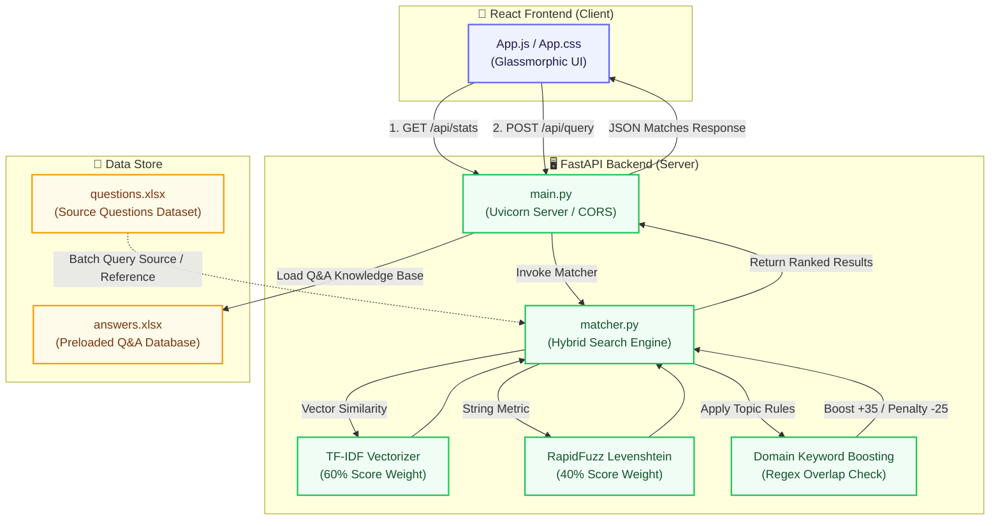

# Excel Q&A Search Assistant

A complete, high-performance web application featuring a **Python FastAPI backend** and a beautiful **React frontend** to perform approximate semantic and fuzzy matching of user queries against a preloaded Excel Q&A spreadsheet.

---

## 🚀 Key Features

* **Hybrid Matching Engine**: Combines TF-IDF Cosine Similarity (60%) and Levenshtein distance Fuzzy Match (40%) to handle both conceptual relevance and exact string similarity.
* **Domain Keyword Boosting**: Dynamically extracts domain-specific terms (filtering out generic noise) to boost scores when keywords overlap, and penalizes when they mismatch.
* **Glassmorphic UI**: Translucent glassmorphic dark-mode search interface with smooth interactive states and modern typography (Outfit and Plus Jakarta Sans).
* **Automatic Stat Engine**: Live synchronization with backend knowledge base reporting total loaded QA records and column names at startup.
* **Margin & Conflict Handling**: Ready to support Top-K result listings, confidence-graded badges, and human-in-the-loop manual selection overrides.

---

## 📁 Workspace Directory Structure

```text
qna/
├── client/               # React Frontend Application
│   ├── src/
│   │   ├── App.js        # Main UI Controller & Search Panel
│   │   └── App.css       # Translucent dark-mode styling system
│   ├── README.md         # React-specific boilerplate documentation
│   └── package.json
├── server/               # FastAPI Python Backend
│   ├── data/
│   │   └── answers.xlsx  # Preloaded Q&A knowledge base
│   ├── matcher.py        # TF-IDF & Fuzzy hybrid matching engine
│   ├── main.py           # REST APIs (Stats & Query resolution)
│   └── requirements.txt  # Python backend dependencies
└── README.md             # Consolidated project documentation (This file)
```

---

## 🏗️ System Architecture



---

## 🖥️ Backend (Server) Deep Dive

The backend is built with **FastAPI** to serve search results in real time from the preloaded spreadsheet database.

### Tech Stack & Dependencies:
* **Python 3.10+**
* **FastAPI & Uvicorn**: For high-performance asynchronous API routing.
* **Pandas & OpenPyXL**: For reading and parsing Excel files.
* **Scikit-Learn**: For TF-IDF Vectorization and Cosine Similarity computations.
* **RapidFuzz**: For ultra-fast Levenshtein token similarity scores.

### REST API Endpoints:

#### 1. `GET /api/stats`
Retrieves metadata about the preloaded Excel knowledge base spreadsheet.
* **Response Body (`200 OK`)**:
  ```json
  {
    "status": "success",
    "total_records": 24,
    "columns": ["Question", "Answer"]
  }
  ```

#### 2. `POST /api/query`
Resolves a text question using the hybrid matching engine.
* **Request Body**:
  ```json
  {
    "query": "how do I get help",
    "threshold": 50.0,
    "top_k": 3
  }
  ```
* **Response Body (`200 OK`)**:
  ```json
  {
    "query": "how do I get help",
    "matches": [
      {
        "matched_question": "mobile platform system crash help",
        "answer": "Report the bug logs to developer team using the in-app support module.",
        "score": 46.8
      }
    ]
  }
  ```

### Backend Installation & Startup:
Navigate to the `server/` directory, set up your virtual environment, and launch the server:
```powershell
# Create virtual environment if not already present
python -m venv .venv

# Activate virtual environment
.venv\Scripts\Activate.ps1

# Install backend dependencies
pip install -r server/requirements.txt

# Run the FastAPI server via Uvicorn
cd server
..\.venv\Scripts\python -m uvicorn main:app --host 127.0.0.1 --port 8000
```
The FastAPI backend server will start on [http://127.0.0.1:8000](http://127.0.0.1:8000).

---

## 🎨 Frontend (Client) Deep Dive

The frontend is a React application styled using a modern, state-of-the-art Glassmorphic UI stylesheet.

### Available Scripts:
In the `client/` directory, you can run:

#### `npm start`
Runs the app in development mode.\
Open [http://localhost:3000](http://localhost:3000) or [http://localhost:3001](http://localhost:3001) to view it in the browser. The page will reload when you make changes.

#### `npm test`
Launches the test runner in the interactive watch mode.

#### `npm run build`
Builds the app for production to the `build` folder, bundling and optimizing React in production mode for the best performance.

---

## 🧠 Hybrid Domain Keyword Matching Logic

The matching engine matches query questions with reference questions using a combination of TF-IDF Cosine Similarity and RapidFuzz fuzzy ratios.

### Domain Keyword Scoring Rule
Non-generic keywords (e.g., `login`, `email`, `crash`) are extracted from both the query and target reference strings using regex, filtering out 40+ common helper/stop words:
```python
# Boost score if domain keywords match, otherwise penalize if they don't overlap
if q1_topics & s2_topics:
    score = min(score + 35.0, 100.0)
else:
    score = max(score - 25.0, 0.0)
```
* **Boost (+35.0 points)**: Granted if there is a non-empty set intersection (`&`) between domain keywords in the query and reference.
* **Penalty (-25.0 points)**: Applied if topic sets fail to overlap or mismatch, preventing false-positives.
