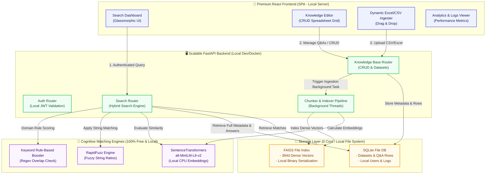

# Future Implementation Plan & TODO List

This document acts as a roadmap and architectural blueprint to upscale the **Q&A Search Assistant** into an enterprise-grade cognitive search platform under a **100% Free & Local-First** setup (zero cloud hosting, zero paid API keys).

---

## 🚀 Future Roadmap & TODO List

### Phase 1: Local Database & JWT Security
- [ ] Initialize standard SQLite database schema (`qna.db`) via SQLAlchemy.
- [ ] Build local user schemas and session tokens using `python-jose` and `bcrypt`.
- [ ] Setup API endpoints under `/api/auth` and implement token security middleware.
- [ ] Implement backend migrations to ingest preloaded spreadsheet answers into the database.

### Phase 2: Local Cognitive Vector Matcher
- [ ] Incorporate `sentence-transformers` library and cache `all-MiniLM-L6-v2` locally on server boot.
- [ ] Create a local file-based **FAISS** vector index.
- [ ] Upgrade `server/matcher.py` to support hybrid scoring:
  - **50% Semantic Score** (FAISS dense embeddings)
  - **30% TF-IDF / Token Score** (exact keywords)
  - **20% Levenshtein Ratio** (RapidFuzz string distance)
- [ ] Add domain keyword boosts dynamically during hybrid score construction.

### Phase 3: Drag & Drop Dataset Upload
- [ ] Build React drag-and-drop wizard components to upload `.xlsx` and `.csv` files.
- [ ] Configure dynamic CSV headers mapping to determine custom question/answer columns on upload.
- [ ] Implement background threads to compute embeddings and index newly uploaded spreadsheets dynamically.

### Phase 4: Glassmorphic Administrative Grid
- [ ] Build administrative tab panel showing virtualized data tables.
- [ ] Enable cell double-click edit, row additions, and deletions with instant database updates.
- [ ] Design search conflict manager flagging elements where scores overlap by <5%.
- [ ] Provide a download function to export any active database table back as an Excel file.

### Phase 5: Containerization & Deployment
- [ ] Create a secure, multi-stage server `Dockerfile`.
- [ ] Compile a `docker-compose.yml` defining unified backend and frontend orchestration.

---

## 🏗️ System Architecture (100% Free & Offline)

---

## 🛠️ Storage & Engine Architecture Choices

1. **Complete Local Isolation (0 Operating Cost)**:
   - Use **SentenceTransformers `all-MiniLM-L6-v2`** running locally on the CPU (RAM overhead: ~120MB, query latency: <10ms) to compute 384-dimensional dense semantic vectors. No external API keys needed.
2. **Database Engine**:
   - Use **SQLite** for relational tables (Datasets, Q&A rows, search analytics logs, local users). Zero memory overhead when idle, highly performant.
3. **Vector Storage**:
   - Use **FAISS (CPU variant)** written directly to a binary file index in the workspace to bypass paid vector databases.

---

## 🧪 Verification & Testing Plan

### Automated Coverage
* Validate local SQLite transactions using Python unit testing libraries.
* Verify vector calculations are returned with high precision under 15ms.
* Run API route suite: `python -m pytest server/test_main.py`

### Manual Verification
1. **Spreadsheet Upload Verification**: Test massive ingestions in `DatasetManager` using local mock spreadsheets (>1,000 rows).
2. **Deep Semantic Test**: Query using conceptual synonyms (e.g. query "How do I secure an account reset link?" versus target "What is the procedure for updating user credentials?").
3. **Responsive UI Audit**: Guarantee smooth transitions and glassmorphism renders perfectly on screens of all sizes (360px wide through 4K displays).
