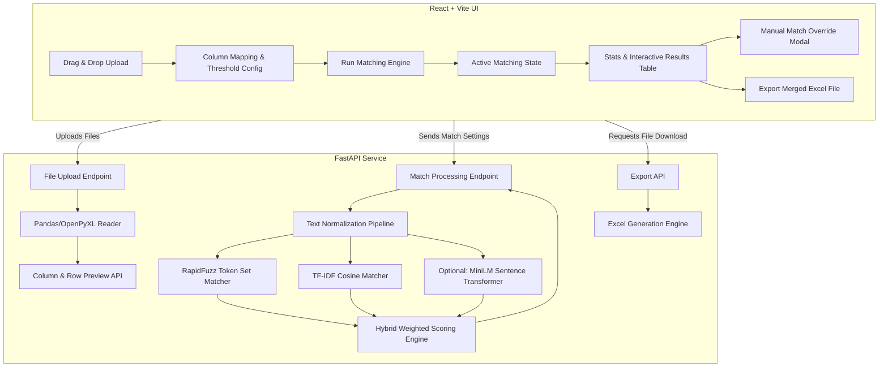

# Implementation Plan - Excel Q&A Matching & Approximation System

We will build a complete web application with a **Python FastAPI backend** and a **React + Vite frontend** to perform approximate matching between two Excel sheets (Question Sheet and Answer Sheet) and fetch the relevant answers. 

The application will feature a hybrid text-matching pipeline (using string similarity, keyword overlaps, and optional sentence embeddings) to handle approximate queries (e.g., matching *"i am facing issue in..."* to *"error in..."*) and a high-end, responsive, glassmorphic UI for full interactive control.

---

## User Review Required

> [!IMPORTANT]
> **Data Format & Column Selection**
> To make this application production-grade and highly reusable, we will **not** hardcode sheet layouts or column names. Instead, the frontend will automatically parse uploaded Excel files and let the user select which columns contain:
> 1. The **Questions** in Sheet 1 (the sheet to be filled).
> 2. The **Reference Questions** in Sheet 2 (the knowledge base).
> 3. The **Answers** in Sheet 2 (the knowledge base).
> Please confirm if this generic column-mapping approach fits your workflow.

> [!IMPORTANT]
> **Multiple Solutions Support & Conflict Resolution**
> When a single question has multiple possible matches/solutions (e.g., similar reference questions with different answers), we will support retrieving and ranking **Top K solutions** (default top 3).
> We propose three export modes in the UI for users to choose how these are saved:
> 1. **Best Match Only**: Exports only the single highest-scoring answer.
> 2. **Multi-Column Export**: Appends multiple solution columns (e.g., `Answer 1`, `Answer 2`, `Answer 3`) to allow auditing side-by-side.
> 3. **Merged Concatenation**: Concatenates multiple answers into a single Excel cell using custom bullet points (e.g., `[85%] Sol A \n[72%] Sol B`).
> Please verify if this multi-solution design meets your needs.

> [!TIP]
> **Matching Algorithms & Resource Trade-offs**
> We propose a hybrid matching pipeline with three tiered algorithms that can be adjusted in the UI:
> 1. **Fuzzy String Matching (RapidFuzz)**: Extremely fast, great for spelling mistakes, word order variations, and partial matches.
> 2. **TF-IDF + Cosine Similarity**: Fast, great for matching key technical words/n-grams.
> 3. **Semantic Embeddings (SentenceTransformers)**: Best for pure semantic similarity (e.g. matching *"facing issue"* with *"error"* even with zero word overlap), but requires downloading a small model (~100MB) on the backend server.
> We plan to implement the **Fuzzy + TF-IDF** combination as the standard baseline, with an optional toggle/fallback for **SentenceTransformers** if local system resources allow.

---

## Open Questions

> [!NOTE]
> 1. **Excel Formats**: Do your Excel sheets typically contain multiple sheets/tabs per file, or are they standard single-sheet spreadsheets (`.xlsx` or `.csv`)? We will support `.xlsx`, `.xls`, and `.csv` formats.
> 2. **Output Layout**: When exporting the final matched Excel sheet, should we append the answers directly to a new column in Sheet 1, or should we output a fully detailed report sheet containing: `[Original Question, Matched Reference Question, Confidence Score, Retrieved Answer]`? (We recommend exporting a detailed report so you can audit the approximation quality).

---

## Proposed Architecture



---

## Proposed Changes

We will create a brand new clean codebase under `c:\Users\Chirag Pradhan\qna\`.

### 1. Backend Service (Python FastAPI)

The backend will handle parsing Excel sheets, running the text approximation algorithms, managing high-performance calculations, and serving the results.

#### [NEW] [requirements.txt](file:///c:/Users/Chirag%20Pradhan/qna/backend/requirements.txt)
Defines all Python dependencies:
- `fastapi`, `uvicorn`, `multipart`: For creating the high-performance API.
- `pandas`, `openpyxl`: For loading, parsing, and creating Excel files.
- `rapidfuzz`: State-of-the-art fast string matching.
- `scikit-learn`: For TF-IDF keyword vectorization and cosine similarity.
- `sentence-transformers` *(optional)*: For high-quality semantic vector matching.

#### [NEW] [matcher.py](file:///c:/Users/Chirag%20Pradhan/qna/backend/matcher.py)
Implements the core approximation matching pipeline supporting multiple solutions:
- Text cleaning (lowercase, strip, special character normalization).
- Hybrid scoring function:
  $$\text{Score} = w_1 \cdot \text{FuzzyTokenSetRatio} + w_2 \cdot \text{TFIDF-CosineSimilarity}$$
- **Top-K Candidates Retrieval**: Finds and ranks the Top K (e.g. top 3 or 5) match candidates above the user-specified threshold.
- Detailed threshold matching and "Conflict Detection" if multiple distinct answers score very close to each other.
- Interface for modular semantic matching using sentence embeddings if enabled.

#### [NEW] [main.py](file:///c:/Users/Chirag%20Pradhan/qna/backend/main.py)
Configures the FastAPI application, CORS middleware, and API endpoints:
- **Local Data Integration**: Automatically checks for pre-placed Excel sheets inside the `server/data/` directory (e.g., `questions.xlsx` and `answers.xlsx`) and offers them as the default database.
- `POST /api/upload`: Receives two files, saves them temporarily, parses headers and first 5 preview rows.
- `POST /api/match`: Takes column selections, threshold, multi-solution limits, and algorithm parameters, runs `matcher.py`, and returns matched rows with their Top-K potential solutions and confidence scores. Supports matching uploaded files OR the pre-placed files inside `server/data/`.
- `POST /api/export`: Generates and streams the merged Excel file in the chosen multi-solution format (Best Match, Multi-Column, or Concatenated) with confidence coloring and highlight styles.

---

### 2. Frontend Application (React + Vite)

The UI will be designed with **premium dark/light-mode-capable glassmorphism aesthetics**, employing custom CSS, subtle transitions, and fully custom interactive widgets instead of basic component libraries.

#### [NEW] [package.json](file:///c:/Users/Chirag%20Pradhan/qna/frontend/package.json)
Configures standard React, Vite, and essential utilities like `lucide-react` for beautiful icons.

#### [NEW] [vite.config.js](file:///c:/Users/Chirag%20Pradhan/qna/frontend/vite.config.js)
Sets up the build tool and configures a proxy to pass backend requests seamlessly to `http://localhost:8000/api`.

#### [NEW] [index.html](file:///c:/Users/Chirag%20Pradhan/qna/frontend/index.html)
Sets up the HTML base, referencing beautiful fonts from Google Fonts (e.g., *Inter* or *Outfit*).

#### [NEW] [App.css](file:///c:/Users/Chirag%20Pradhan/qna/frontend/src/App.css)
Creates the complete, custom, visual experience:
- Modern CSS variables for dynamic color systems (neon-accents, slate backgrounds, glass panels).
- Smooth grid layouts, custom-styled scrollbars, and keyframe loading animations.
- Glassmorphic panels with `backdrop-filter: blur(12px)`.
- Responsive design for full-width high-resolution monitors.

#### [NEW] [App.jsx](file:///c:/Users/Chirag%20Pradhan/qna/frontend/src/App.jsx)
Manages the global application state:
- Uploaded file metadata and previews.
- App configurations (similarity threshold, selected columns, matching mode).
- API loading states and matching progress.
- Clean view switching between **Upload State**, **Matching State**, and **Results Dashboard**.

#### [NEW] [FileUpload.jsx](file:///c:/Users/Chirag%20Pradhan/qna/frontend/src/components/FileUpload.jsx)
A premium drag-and-drop file upload zone.
- Visual file feedback (shows file name, type, and size).
- Error handling for invalid files (e.g., non-Excel uploads, corrupted structures).
- Live previews of parsed headers and sheet contents.

#### [NEW] [MatchConfig.jsx](file:///c:/Users/Chirag%20Pradhan/qna/frontend/src/components/MatchConfig.jsx)
The configuration dashboard allowing full user control:
- Dropdown selectors to map Question columns and Answer columns dynamically.
- An interactive similarity threshold slider with live percentage status (e.g., *"Filter out matches below 65%"*).
- **Multi-Solution Selector**: Control how many alternative answers to retrieve (e.g., 1 to 5) and choose the Excel Export Mode (Best Match, Multi-Column, or Concatenated).
- Advanced algorithm toggles.

#### [NEW] [ResultsTable.jsx](file:///c:/Users/Chirag%20Pradhan/qna/frontend/src/components/ResultsTable.jsx)
The central operational screen:
- A search and filter bar to isolate results (e.g. *"Show only Low Confidence Matches"*, *"Show Conflicts"* or search query).
- A beautifully styled table showing the active selected matches and:
  - **Expandable Rows**: Clicking on a question expands a slide-out drawer containing a list of **all retrieved solutions (Top K)**.
  - **Solution Card Grid**: Inside the drawer, each alternative answer is displayed as a sleek glassmorphic card showing the matched reference question, answer text, and confidence percentage.
  - **Click-to-Swap Override**: Users can easily click on any alternative solution card to promote it to the primary answer.
  - **Conflict / Multi-Solution Badge**: A specialized badge highlighting when a question has multiple high-confidence solutions, prompting the user for manual validation.

#### [NEW] [DashboardStats.jsx](file:///c:/Users/Chirag%20Pradhan/qna/frontend/src/components/DashboardStats.jsx)
A quick-glance analytics grid highlighting:
- Total matching percentage (e.g., 94% overall success rate).
- Total questions processed vs. successfully answered.
- **Multiple Solution Conflicts**: Counts the number of questions where multiple strong matches were detected, helping users jump straight to high-priority reviews.
- Total low confidence alerts needing manual review.

---

## Verification Plan

### Creating Test Data (Local Excel Sheets)
To test the approximate matching pipeline locally with valid Excel formats, run this Python script in your `server/` directory:
```powershell
python -c "import pandas as pd; pd.DataFrame({'Question': ['i am facing issue in login', 'how to reset password', 'payment failed']}).to_excel('data/questions.xlsx', index=False); pd.DataFrame({'Question': ['login error occurred', 'password reset procedure', 'payment issue'], 'Answer': ['Please clear your browser cookies and cache.', 'Go to settings and click Reset Password.', 'Verify your card details and try again.']}).to_excel('data/answers.xlsx', index=False); print('Success: Created valid questions.xlsx and answers.xlsx!')"
```

### Automated/Unit Testing
- **Backend Algorithms**: Run internal unit tests on `matcher.py` with edge cases (e.g. empty strings, exact matches, complex phrases like *"how do I reset"* vs *"password reset procedure"*).
- **Endpoint validation**: Run API tests checking handling of malformed Excel sheets and missing columns.

### Manual Verification Flow
1. **Upload Phase**:
   - Verify drag-and-drop handles `.xlsx` and `.csv` files correctly.
   - Confirm file preview generates instantly on the UI.
2. **Matching Quality Phase**:
   - Provide exact duplicate questions -> verify matching is $100\%$.
   - Provide approximate matches (e.g. *"facing issues in logging in"* vs *"login error occurred"*) -> verify it yields high confidence score matches (>75%) and retrieves the correct answers.
   - Adjust the similarity slider in real time to filter matches.
3. **Override Flow**:
   - Trigger the override modal on a match, pick a different reference question, and verify the UI updates the matched answer instantly.
4. **Export Phase**:
   - Click "Export" and open the generated Excel file. Ensure all matched questions, answers, and confidence ratings are present, properly aligned, and formatted cleanly.
